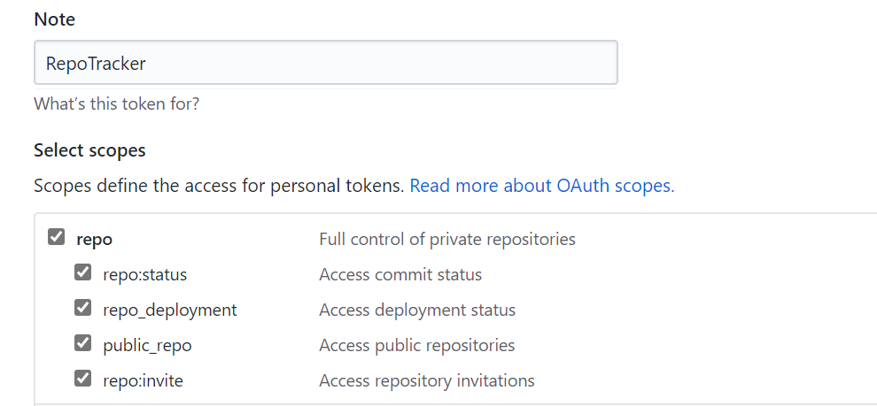
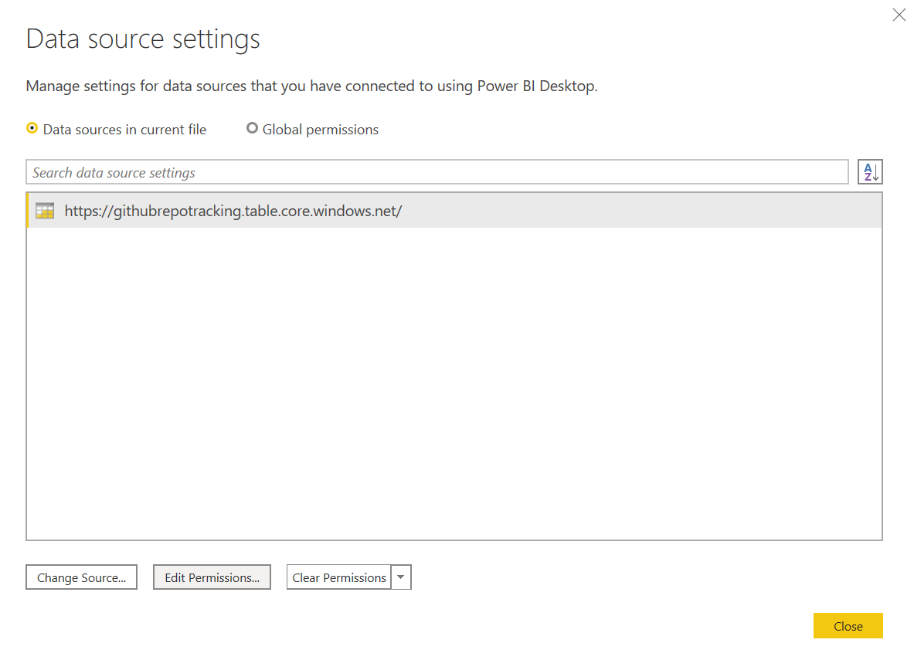
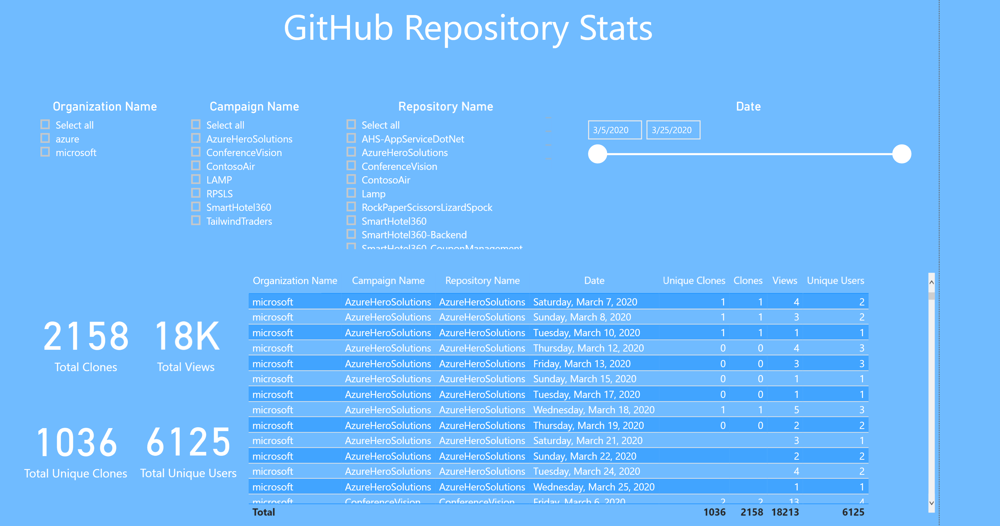

# GitHub Stat Tracker

Have you ever wanted to see GitHub Traffic data for more than 2 weeks? This tool is an Azure Function that "polls" GitHub Traffic data everyday and tracks Views and Clones, which GitHub Insights does not keep after 2 weeks. For more info, check out my [blog post](https://www.isaaclevin.com/post/github-stats-tracking) on it

## Obtain GitHub Token

Head over to [https://github.com/settings/tokens](https://github.com/settings/tokens) and generate a new token with all repo access.



## Deploy to Azure

Next thing to do is create the infrastructure in Azure, which is as follows

- Azure Function (running on Consumption Plan)
- Azure Storage
- Application Insights

[](https://portal.azure.com/#create/Microsoft.Template/uri/https%3A%2F%2Fraw.githubusercontent.com%2Fisaacrlevin%2FGitHubStatTracker%2Fmaster%2Fazuredeploy.json)

This will direct you to the Template creation screen in Azure, enter in the required info, as well as the GitHub Token you obtained earlier.

Once the template deployment is created, the infrastructure is deployed. Next step would be cloning the code and publishing to Azure from Visual Studio or Visual Studio Code. After that, you are good to go!

## Configure your Repos

As I mentioned earlier, for any repo you want to track, you have to have push access to the repo with the user account you created the token with. The last thing that you need to do is add the repos you want tracked. To do this, you will need to add a .json file to a blob container in the Azure Storage account you created earlier. You can learn to do that [here](https://docs.microsoft.com/en-us/azure/storage/blobs/storage-quickstart-blobs-portal). The name of the json file needs to be `Repos.json` and have a schema as following

```json
[
  {
    "CampaignName": "",
    "OrgName": "",
    "Repos": [ { "RepoName": "" } ]
  },
  {
    "CampaignName": "",
    "OrgName": "",
    "Repos": [
      { "RepoName": "" }
    ]
  }
]
```

Once you have this file uploaded, your function will populate an Azure Table Storage entity with the traffic data for each day. From there, you can do whatever you want with the data, including creating a Power BI Dashboard.

## Creating a Dashboard

One great way to see this data is by exposing it via a Power BI Dashboard. Included in this repo is a .pbix file that you can edit with Power BI Desktop to point at your own Azure Table Storage. To do that, open the file and edit the data source of the data set.



After that, make sure you can refresh the data and make sure the Report populates properly.



